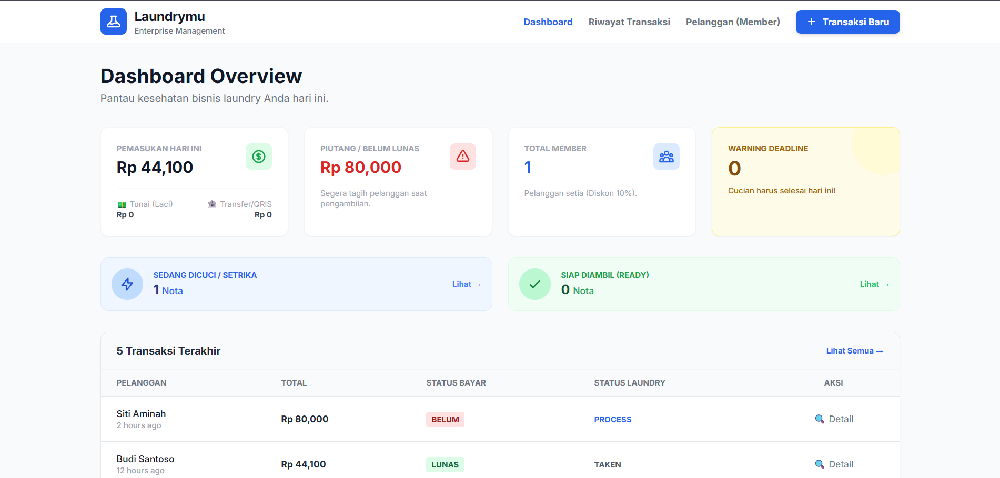
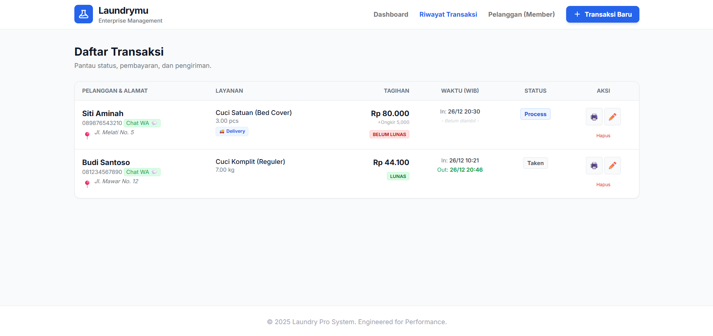

# Laundrymu

**Laundrymu** adalah sistem manajemen operasional laundry berbasis web yang dibangun menggunakan framework **Laravel**. Berbeda dengan aplikasi CRUD standar, sistem ini dirancang dengan **Logika Bisnis Dunia Nyata (Real-World Logic)** untuk menangani operasional harian, pemantauan keuangan yang akurat, serta manajemen pelanggan.


---

## Tangkapan Layar (Screenshots)

|             **Dashboard Operasional**             |                  **Form Transaksi**                   |
| :-----------------------------------------------: | :---------------------------------------------------: |
|  |  |

---

## Fitur Unggulan

### 1. Dashboard Cerdas

-   **Breakdown Keuangan:** Memisahkan laporan pemasukan **Tunai (Laci Kasir)** vs **Transfer/QRIS** untuk memudahkan closingan harian (rekap kas).
-   **Deadline Alert:** Peringatan visual (Warning) untuk cucian yang harus selesai hari ini atau yang sudah terlambat.
-   **Status Operasional:** Memantau beban kerja laundry (Berapa nota yang sedang dicuci vs siap diambil).

### 2. Manajemen Transaksi & Kasir

-   **Fleksibilitas Pembayaran:** Mendukung pembayaran di muka (**Prepaid**) maupun bayar nanti saat ambil (**Postpaid**).
-   **Sistem Delivery:** Perhitungan ongkir otomatis dan tampilan alamat pengiriman khusus kurir.
-   **Fitur Backdate:** Memungkinkan admin menginput transaksi yang terlewat (kemarin) dengan tanggal yang sesuai untuk pembukuan.
-   **Cetak Struk Otomatis:** Menghasilkan nota profesional dengan cap status "LUNAS/BELUM LUNAS".

### 3. Manajemen Pelanggan

-   **Sistem Membership:** Fitur _toggle_ simpel untuk upgrade status pelanggan. Member otomatis mendapatkan **Diskon 10%**.
-   **Loyalty Tracker:** Menampilkan statistik "Total Cucian" & "Total Pengeluaran" untuk mengidentifikasi pelanggan VIP.
-   **Informasi Kurir:** Kolom khusus "Patokan/Landmark" pada alamat untuk mencegah kurir tersesat.
-   **Integrasi WhatsApp:** Tombol langsung untuk chat pelanggan terkait status cucian.

---

## Teknologi yang Digunakan

-   **Backend:** Laravel Framework (PHP)
-   **Frontend:** Blade Templates + Tailwind CSS
-   **Database:** MySQL
-   **Tools:** Git, Composer

---

## Instalasi & Penggunaan

Ikuti langkah berikut untuk menjalankan proyek di komputer lokal:

1.  **Clone Repository**

    ```bash
    git clone [https://github.com/rifkyprataama/Laundrymu.git](https://github.com/rifkyprataama/Laundrymu.git)
    cd Laundrymu
    ```

2.  **Install Dependencies**

    ```bash
    composer install
    npm install && npm run build
    ```

3.  **Konfigurasi Environment**

    -   Salin file `.env.example` menjadi `.env`
    -   Sesuaikan konfigurasi database di file `.env`

    ```bash
    cp .env.example .env
    php artisan key:generate
    ```

4.  **Migrasi Database**

    ```bash
    php artisan migrate
    ```

5.  **Jalankan Aplikasi**
    ```bash
    php artisan serve
    ```
    Buka browser dan akses `http://127.0.0.1:8000`

---

## Struktur Database

Sistem ini menggunakan basis data relasional yang terintegrasi:

-   **Customers:** Menyimpan profil, status member, dan patokan lokasi.
-   **Services:** Menyimpan jenis layanan, satuan (kg/pcs), dan harga dasar.
-   **Transactions:** Menghubungkan pelanggan & layanan dengan logika diskon, biaya antar, dan tenggat waktu (deadline).

---

## Penulis

**Rifky Daffa Pratama**

-   [Profil GitHub](https://github.com/rifkyprataama)

---
